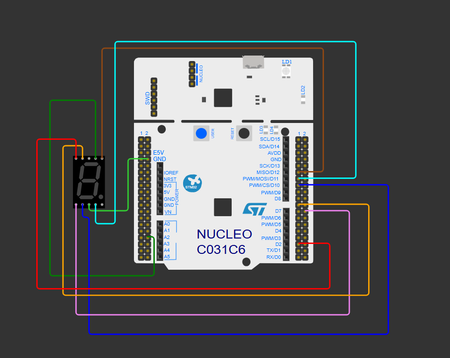

# STM32C0 7-Segment Blinking "1" Project

This repository contains a simple project that controls a common cathode **7-segment display** using an **STM32C031C6 (Nucleo-C031C6)** microcontroller. This simulation project is built and tested using the **Wokwi** simulator.

---

## Project Overview

The project makes the number **"1"** flash on a 7-segment display continuously. 

The application works in a simple loop:
1. It turns on the correct segments to show the number "1".
2. It waits for 1 second.
3. It turns off all the segments so the screen becomes dark.
4. It waits for another 1 second and then restarts the cycle.

---

## Pin Connections

The project uses a **common cathode** display. This means the common ground pin must connect to the GND pin on the Nucleo board. The other segments (A to G) connect to pins `PA4` through `PA10`.

Here is the wiring connection map:

| Nucleo Pin | 7-Segment Pin | Wire Color | Description |
| :--- | :--- | :--- | :--- |
| **GND** | COM.1 | Black | Main ground connection |
| **PA4** | A | Green | Segment A control |
| **PA5** | B | Green | Segment B control (Active for "1") |
| **PA6** | C | Green | Segment C control (Active for "1") |
| **PA7** | D | Green | Segment D control |
| **PA8** | E | Green | Segment E control |
| **PA9** | F | Green | Segment F control |
| **PA10** | G | Green | Segment G control |

*Note: Pins **PA2** and **PA3** are reserved for the Serial Monitor (UART communication) and are not connected to the display.